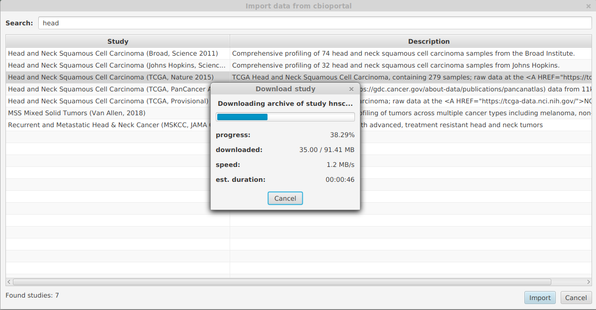
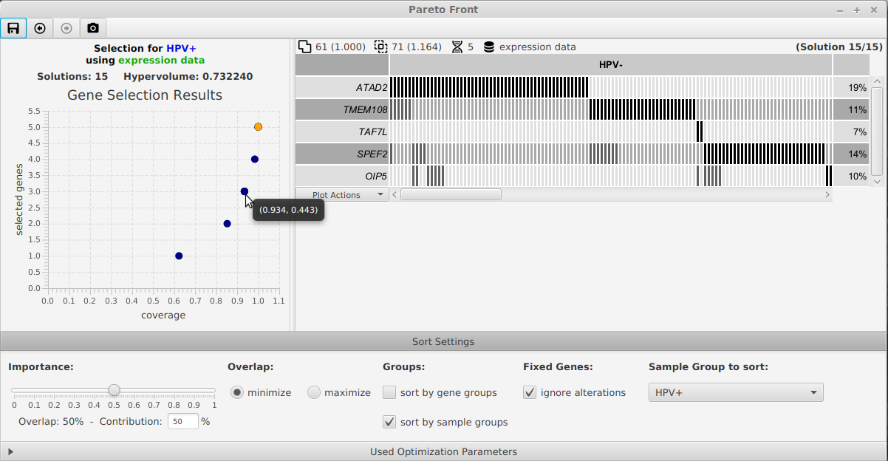

# Avatar - Analysis and Visualization of Alteration Data

[](https://www.eclipse.org/legal/epl-v20.html)

Avatar is a readily usable standalone software for analysis and visualisation of alteration data.

Avatar features interactively customizable alteration plots, 
extensive data import capabilities and a multi-objective optimization algorithm
to find alteration patterns, 
e.g. gene sets with mutually exclusive alterations or small gene sets with high sample coverage.


*Import dialog for study data from cBioPortal.*


*Optimization result dialog for interactive exploration of the Pareto-set of trade-off solutions.*


## Installation

Download the binaries for your operating system below:

* [Windows](https://github.com/sysbio-bioinf/avatar/raw/master/dist/avatar-0.4.10-windows.zip)
* [Linux](https://github.com/sysbio-bioinf/avatar/raw/master/dist/avatar-0.4.10-linux.tar.gz)
* [Mac OS X](https://github.com/sysbio-bioinf/avatar/raw/master/dist/avatar-0.4.10.dmg)

For Windows and Linux extract the files from the archive and run the `avatar` binary.
For Mac OS X double click the dmg image and then open the avatar volume from your desktop to run the `avatar` binary.

You can also download the [jar file for Linux](https://github.com/sysbio-bioinf/avatar/raw/master/dist/avatar-0.4.10.jar) which needs an installed Java 11.

## Publication Data

### Walkthrough

To get an impression of the capabilities of Avatar, you can read the [walkthrough](https://github.com/sysbio-bioinf/avatar/raw/master/dist/walkthrough.pdf)
of the Head and Neck Squamous Cell Carcinomas usecase.

### Additional Data

* The **preprocessed clinical attributes** can be download as [preprocessed-clinical-data.tsv](https://github.com/sysbio-bioinf/avatar/raw/master/dist/preprocessed-clinical-data.tsv).
* The used **list of Cancer-Testis-Antigens** can be downloaded as [cancer-testis-antigens.txt](https://github.com/sysbio-bioinf/avatar/raw/master/dist/cancer-testis-antigens.txt).
* The **use case file with optimization results** can be downloaded as [hnsc.optimized.avatar](https://github.com/sysbio-bioinf/avatar/raw/master/dist/hnsc.optimized.avatar).
* The **file of the BRCA analysis in the supplement** based on the multi-dendrix BRCA dataset can be downloaded as [multi-dendrix-BRCA.optimized.avatar](https://github.com/sysbio-bioinf/avatar/raw/master/dist/multi-dendrix-BRCA.optimized.avatar).

## Development

Clone this project from Github and switch to the downloaded directory:
```
git clone git@github.com:sysbio-bioinf/avatar.git
cd avatar
```

Avatar is organized as a [Leiningen](https://leiningen.org/) project.
After you have installed [Leiningen](https://leiningen.org/), 
you can build Avatar with the following command:

```bash
lein build
```

After that, the resulting standalone jar file can be found at `target/avatar-x.y.z.jar`.

## License

Copyright © 2016-present Gunnar Völkel

Avatar is distributed under the Eclipse Public License v2.0.


## Cite

If you are using this software please cite.... ***UPCOMING***
